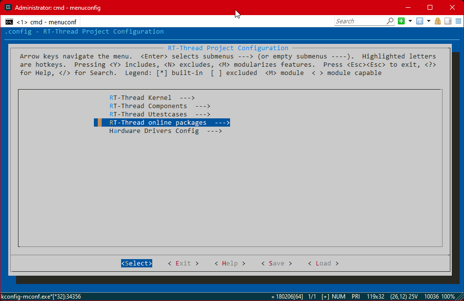
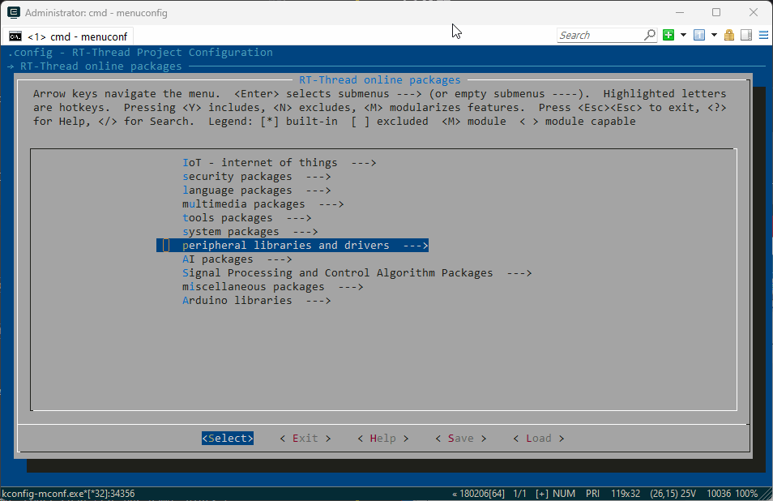
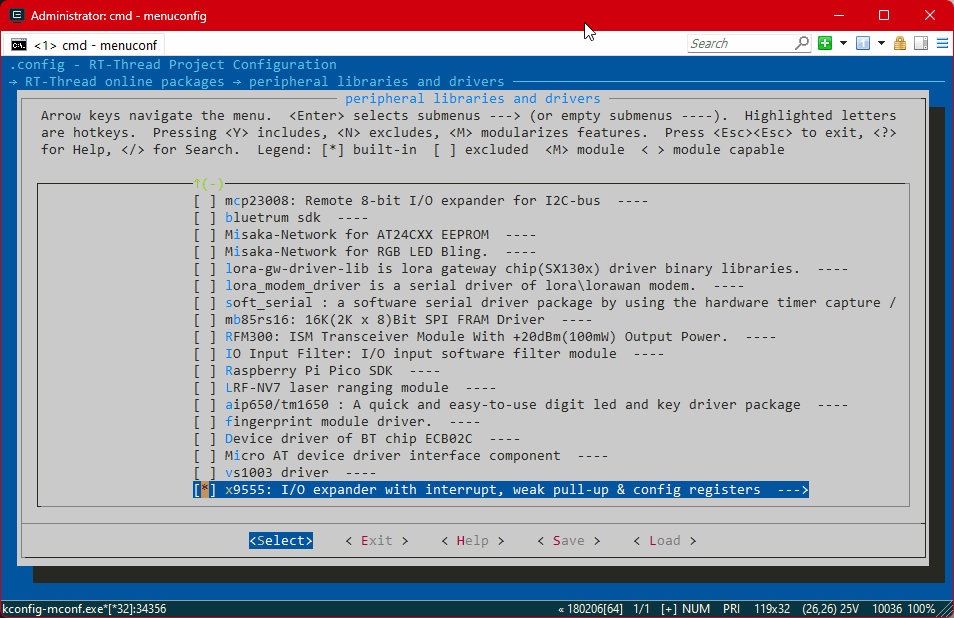
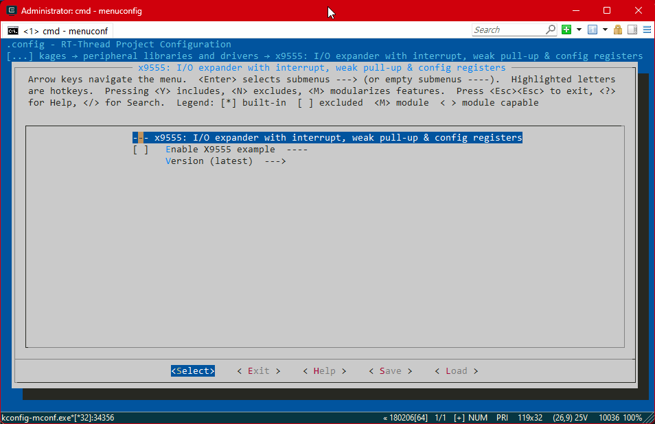
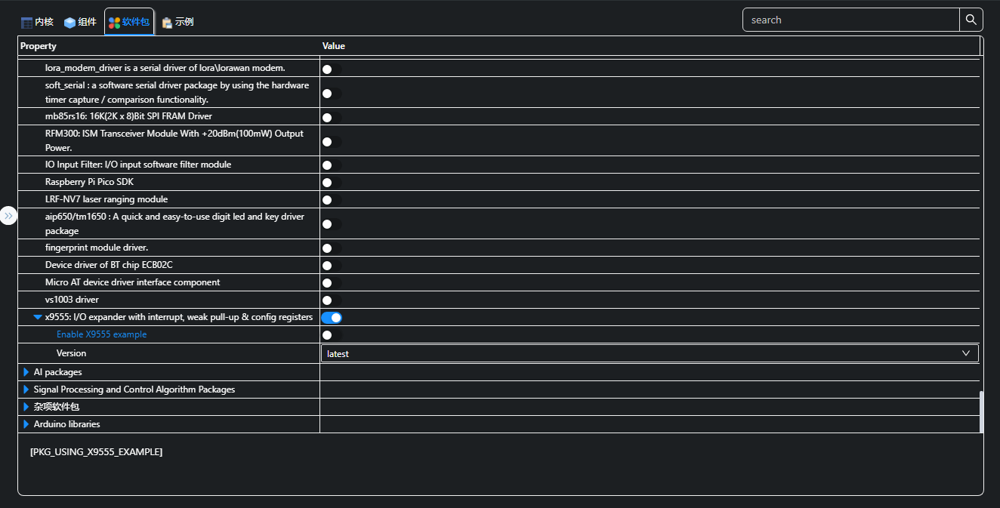
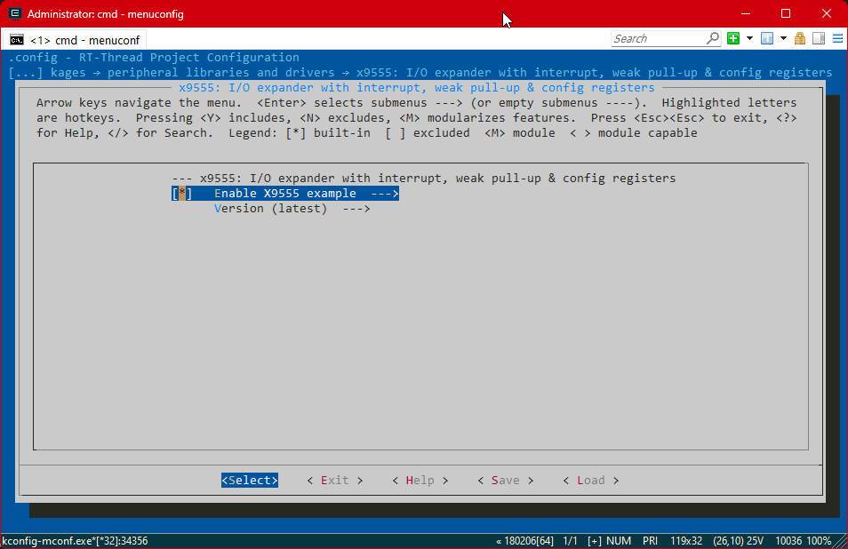
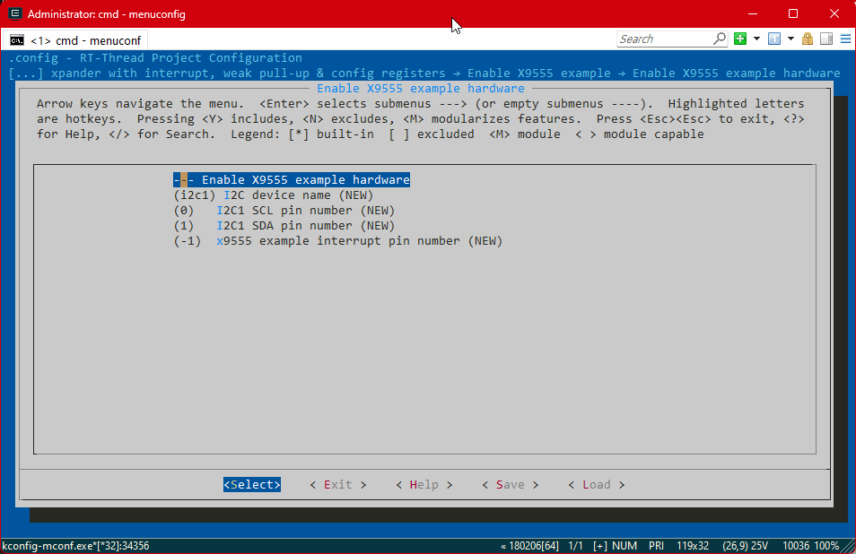
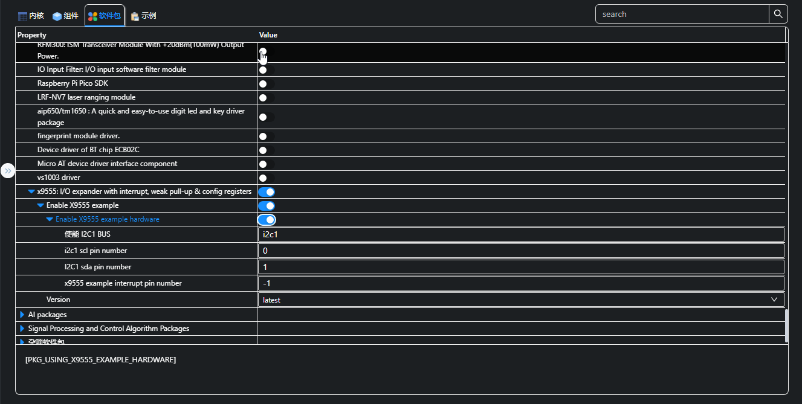

# x9555 软件包

## 1 介绍

x9555 软件包提供了x9555 系列 I/0 扩展器的全部操作功能。本文介绍该软件包的功能操作，以及 `Finsh/MSH` 测试命令等。
目前已在 CAT9555, NCA9555，PCA9555，PI4IOE5V9555，TCA9555验证通过。

### 1.1 目录结构

| 名称 | 说明 |
| ---- | ---- |
| x9555.h | I/0 扩展器头文件 |
| at24cxx.c | I/0 扩展器源代码 |
| example | I/0 扩展器测试示例 |
| x9555_example.c | I/0 扩展器测试示例源代码 |
| SConscript | RT-Thread 默认的构建脚本 |
| README.md | 软件包使用说明 |
| datasheet | 官方数据手册 |
| image | 配置文件图片 |

### 1.2 许可证

x9555 软件包遵循  Apache-2.0 许可，详见 LICENSE 文件。

### 1.3 依赖

依赖 `RT-Thread I2C` 设备驱动框架。

## 2 获取软件包

使用 `x9555` 软件包需要在 RT-Thread 的包管理器中选择它，具体路径如下：

```
RT-Thread online packages
    peripheral libraries and drivers  --->
        [*] x9555: I/O expander with interrupt, weak pull-up & config registers  --->
```
1. ENV配置方法：





2. RT-Studio配置方法：
   

每个功能的配置说明如下：

- `x9555: I/O expander with interrupt, weak pull-up & config registers`：选择使用 `x9555` 软件包；
- `Version`：配置软件包版本，默认最新版本。

然后让 RT-Thread 的包管理器自动更新，或者使用 `pkgs --update` 命令更新包到 BSP 中。

## 3 使用 x9555 软件包

按照前文介绍，获取 `x9555` 软件包后，就可以按照 下文提供的 API 使用 I/O扩展器 `x9555 与 `Finsh/MSH` 命令进行测试，详细内容如下。

### 3.1 API

#### 3.1.1  初始化 

`x9555_device_t x9555_init(const char *interrupt_pin_name, const char *i2c_bus_name, uint8_t device_user_input_address)

根据总线名称，自动初始化对应的 x9555 设备，具体参数与返回说明如下表:

| 参数 | 描述 |
| :----- | :----------------------- |
| interrupt_pin_name   | x9555 输入中断pin名称 [ 例如："PA.00" , 如不使用输入："RT_NULL" ] |
| i2c_bus_name   | x9555 使用的 i2c 设备名称 [ 例如："i2c1" ] |
| device_user_input_address   | x9555 用户配置的地址 [ 例如：A2 A1 A0 -> 0 0 1, 输入：0x01] |
| **返回** | **描述** |
| != NULL | 将返回 x9555 设备对象 |
| = NULL | 查找失败 |

#### 3.1.2  反初始化

void x9555_deinit(x9555_device_t device)

如果设备不再使用，反初始化将回收 x9555 设备的相关资源，具体参数说明如下表：

| 参数 | 描述 |
| :--- | :------------- |
| device  | x9555 设备对象 |

#### 3.1.3 x9555 port 配置

rt_err_t x9555_port_config(x9555_device_t device, rt_uint8_t port, rt_uint8_t config_register, rt_uint8_t register_value)

通过 `x9555` 寄存器配置 ，设置 port 的工作模式：

| 参数 | 描述 |
| :------- | :------------- |
| device | x9555 设备对象 |
| port | x9555 待设置端口 |
| config_register | x9555 port 待配置寄存器地址 |
| register_value | x9555 port 待配置寄存器值 |
| **返回** | **描述** |
| != RT_EOK | 配置成功 |
| = RT_EOK| 配置失败 |

#### 3.1.4 x9555 中断复位

rt_err_t x9555_interrupt_clear(x9555_device_t device, char *interrupt_get_value)

通过读取 `x9555` port 输入寄存器值 ，[ 清除 / 复位 ] 中断：

| 参数 | 描述 |
| :------- | :------------- |
| device | x9555 设备对象 |
| interrupt_get_value | x9555 port0 和 port1 输入值 |
| **返回** | **描述** |
| != RT_EOK | 中断复位成功 |
| = RT_EOK| 中断复位失败 |

#### 3.1.5 x9555 port 模式设置

rt_err_t x9555_port_mode(x9555_device_t device, rt_uint8_t port, rt_uint8_t port_mode)

设置 `x9555` port0 或 port1 的模式为 [ 输入模式 或 输出模式 或 输入极性反转模式 ]：

| 参数 | 描述 |
| :------- | :------------- |
| device | x9555 设备对象 |
| port | x9555 待设置端口 |
| port_mode | x9555 port 模式 |
| **返回** | **描述** |
| != RT_EOK | 配置成功 |
| = RT_EOK| 配置失败 |

#### 3.1.6 x9555 port 输出

rt_err_t x9555_port_write(x9555_device_t device, rt_uint8_t port, rt_uint8_t port_value)

设置 `x9555` port0 或 port1 的输出值：

| 参数 | 描述 |
| :------- | :------------- |
| device | x9555 设备对象 |
| port | x9555 待设置端口 |
| port_value | x9555 port 输出值 |
| **返回** | **描述** |
| != RT_EOK | 配置成功 |
| = RT_EOK| 配置失败 |

#### 3.1.7 x9555 port 输入

rt_uint8_t x9555_port_read(x9555_device_t device, rt_uint8_t port, rt_uint8_t port_mode)

读取 `x9555` port0 或 port1 的值 [ 输出值 或 输入值]：

| 参数 | 描述 |
| :------- | :------------- |
| device | x9555 设备对象 |
| port | x9555 待设置端口 |
| port_mode | x9555 port 模式 |
| **返回** | **描述** |
| rt_uint8_t| port [输出值 或 输入值] |

#### 3.1.8 x9555 pin 模式设置

rt_err_t x9555_pin_mode(x9555_device_t device, rt_uint8_t pin, rt_uint8_t pin_mode)

设置 `x9555` 任意 pin 的模式为 [ 输入模式 或 输出模式 或 输入极性反转模式 ]：

| 参数 | 描述 |
| :------- | :------------- |
| device | x9555 设备对象 |
| pin | x9555 待设置 pin |
| pin_mode | x9555 pin 模式 |
| **返回** | **描述** |
| != RT_EOK | 配置成功 |
| = RT_EOK| 配置失败 |

#### 3.1.9 x9555 pin 输出

rt_err_t x9555_pin_write(x9555_device_t device, rt_uint8_t pin, rt_uint8_t pin_state)

设置 `x9555` 任意 pin 的输出值：

| 参数 | 描述 |
| :------- | :------------- |
| device | x9555 设备对象 |
| pin | x9555 待设置 pin |
| pin_state | x9555 pin 输出值 |
| **返回** | **描述** |
| != RT_EOK | 配置成功 |
| = RT_EOK| 配置失败 |

#### 3.1.10 x9555 pin 输入

rt_bool_t x9555_pin_read(x9555_device_t device, rt_uint8_t pin,rt_uint8_t pin_mode)

读取 `x9555` 任意 pin 的值 [ 输出值 或 输入值]：

| 参数 | 描述 |
| :------- | :------------- |
| device | x9555 设备对象 |
| pin | x9555 待设置 pin |
| pin_mode | x9555 pin 模式 |
| **返回** | **描述** |
| rt_bool_t| pin [输出值 或 输入值] |

### 3.2 Finsh/MSH 测试命令

x9555 软件包提供了丰富的测试命令，项目只要在 RT-Thread 上开启 Finsh/MSH 功能即可。在做一些基于 `x9555` 的应用开发、调试时，这些命令会非常实用。具体功能可以输入 `x9555` ，可以查看完整的命令列表。
1. env配置方法：
a. 使能x9555 软件包 Example： `Enable x9555 example`

b. 配置x9555 软件包 Example 使用到的硬件（前提是其他文件内没有相关的配置）： `Enable x9555 example hardware`

c. 配置硬件信息：


2. RT-Studio 配置方法：
   
```
msh >x9555
Usage:
x9555 create <device interrupt pin> <device name> <device address> 	 - create x9555 by given name.
Example 1 :x9555 create PA.00 i2c1 0x01
Example 2 :x9555 create RT_NULL i2c1 0x01

x9555 interrupt_clear 						 - x9555 interrupt clear.
x9555 port_config <port> <config register> <register value> 	 - config x9555 register.
x9555 port_mode <port> <port mode> 				 - set x9555 port mode.
x9555 port_write <port> <port value> 				 - set x9555 port output.
x9555 port_read <port> <port mode> 				 - get x9555 port input.
x9555 pin_mode <pin> <pin mode> 				 - set x9555 io mode.
x9555 pin_write <pin> <pin state> 				 - set x9555 io output.
x9555 pin_read <pin> <pin mode> 				 - get x9555 io input.

X9555 Register:
X9555_Register_Input_Port_0 			 0x00
X9555_Register_Input_Port_1 			 0x01
X9555_Register_Output_Port_0 			 0x02
X9555_Register_Output_Port_1 			 0x03
X9555_Register_Polarity_Inversion_Port_0 	 0x04
X9555_Register_Polarity_Inversion_Port_1 	 0x05
X9555_Register_Configuration_Port_0 		 0x06
X9555_Register_Configuration_Port_1 		 0x07

X9555 Pin State:
X9555_PIN_LOW 	 0x00
X9555_PIN_HIGH 	 0x01

X9555 Port Number:
X9555_PORT_0 		 0x00
X9555_PORT_1 		 0x01

X9555 (pin or port) Mode:
X9555_OUTPUT 			 0x00
X9555_INPUT 			 0x01
X9555_POLARITY_INVERSION 	 0x02

X9555 IO PORT 0:
X9555_IO_0_0 		 0
X9555_IO_0_1 		 1
X9555_IO_0_2 		 2
X9555_IO_0_3 		 3
X9555_IO_0_4 		 4
X9555_IO_0_5 		 5
X9555_IO_0_6 		 6
X9555_IO_0_7 		 7

X9555 IO PORT 1:
X9555_IO_1_0 		 10
X9555_IO_1_1 		 11
X9555_IO_1_2 		 12
X9555_IO_1_3 		 13
X9555_IO_1_4 		 14
X9555_IO_1_5 		 15
X9555_IO_1_6 		 16
X9555_IO_1_7 		 17

msh >

```

#### 3.2.1 在指定的 i2c 总线上通过 x9555 命令测试设备 

```
1. 当第一次使用 `x9555` 命令时，需要输入以下命令创建设备:
   `x9555 create <device interrupt pin> <device name> <device address>` ;
   其中 :
   `<device interrupt pin>` -> x9555 输入中断pin名称 [ 例如："PA.00" , 如不使用输入："RT_NULL" ]; 
   `<device name>` -> x9555 使用的 i2c 设备名称 [ 例如："i2c1" ];  
   `<device address>` -> x9555 用户配置的地址 [ 例如：A2 A1 A0 -> 0 0 1, 可输入10进制数：1，或16进制数：0x01，或2进制数：0b001 ] 。

Example 1 : `x9555 create PA.00 i2c1 0x01`；
Example 2 :`x9555 create RT_NULL i2c1 0x01`；
如果有 `I2C1` 这个设备，就不会提示错误；
如果总线上没有 `I2C1` 这个设备，将会显示提示找不到相关设备。

2. 如下指令使用技巧：
   x9555 port_config <port> <config register> <register value>
   参数：<register value> [ 例如：可输入10进制数：85，或16进制数：0x055，或2进制数：0b01010101 ]
   x9555 port_write <port> <port value>
   参数：<port value> [ 例如：可输入10进制数：170，或16进制数：0x0aa，或2进制数：0b10101010 ]
```

## 4 注意事项

- 从设备地址 `device_user_input_address` 指 x9555 用户配置的地址 [ 例如：A2 A1 A0 -> 0 0 1, 可输入10进制数：1，或16进制数：0x01，或2进制数：0b001 ] ，与 x9555 IC 内部固定地址无关。

## 5 联系方式

* 维护：[WennianYan](https://github.com/WennianYan)
* 主页：https://github.com/WennianYan/x9555
